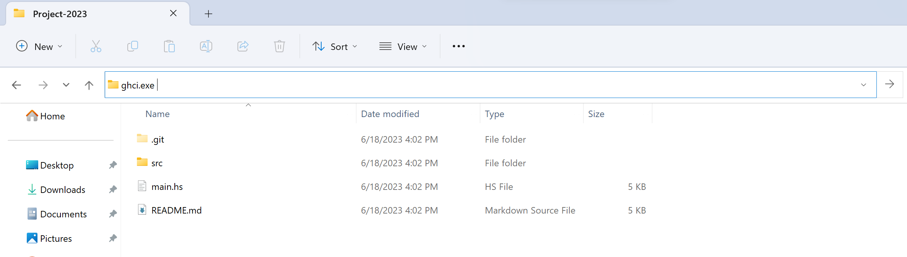

# Intérprete de juegos de misterio y habilidades

## Uso

### Configuración

- Instalar GHCi

  - Ejecutar el siguiente comando en Powershell

    ```console
    Set-ExecutionPolicy Bypass -Scope Process -Force;[System.Net.ServicePointManager]::SecurityProtocol = [System.Net.ServicePointManager]::SecurityProtocol -bor 3072; try { Invoke-Command -ScriptBlock ([ScriptBlock]::Create((Invoke-WebRequest https://www.haskell.org/ghcup/sh/bootstrap-haskell.ps1 -UseBasicParsing))) -ArgumentList $true } catch { Write-Error $_ }
    ```

  - [Documentación de GHCi](https://downloads.haskell.org/ghc/latest/docs/users_guide/ghci.html)

### Run

1. Abrir `ghci.exe` en el path del proyecto.

    

2. Agregar la carpeta src al path de búsqueda de módulos. (`:set -i./src`)

    

3. Cargar el modulo principal. (`:l main.hs`)
4. Comenzar la partida (`play`)

    

## ¿Cómo funciona?

El juego se desarrolla de acuerdo con las especificaciones establecidas en el archivo StoryManager.hs, llevándolo a cabo hasta que el usuario alcance la victoria o decida abandonar. El programa garantiza un cumplimiento completo y detallado de todas las características y condiciones establecidas en las especificaciones.

### Especificaciones

Todas las especificaciones enlistadas a continuación son **requisitos indispensables** para el correcto funcionamiento del intérprete. En caso de existir alguna que no lo sea, se especificara claramente su carácter opcional.

1. Verbos, sustantivos, proposiciones y palabras clave. Son el conjunto de palabras que puede utilizar el usuario para efectuar acciones en el juego. Es importante destacar no es sensible a mayúsculas y minúsculas, pero si a las tildes, por lo que si se quiere que se reconozca una palabra con tilde hay que ponerla en el conjunto de palabras equivalentes.

    ```haskell
    -- (Tipo de Token) (Palabra principal) (Palabras equivalentes) 

    availableVerbs = [
      Verb "examinar" ["examinar", "mirar", "observar"]
    ]

    availableNouns = [
      Noun "melon" ["melon", "sandia"]
    ]

    availablePrepostion = [
      Preposition "con" ["con"]
    ]

    availableKeywords = [
      Keyword "ayuda" ["ayuda"]
    ]
    ```

2. **Inventario**, todos los elementos con los que comienza el jugador. En caso de no aplicar el inventario o que el jugador empiece con este vacío, se deberá definir un array vacío.

    ```haskell
    -- ejemplo de inventario vacío
    initialInventory :: Inventory
    initialInventory = Inventory []

    -- ejemplo de inventario con 2 objetos
    initialInventory :: Inventory
    initialInventory = Inventory ["martillo", "palanca"]
    ```

3. **Flags**, definen las características iniciales de cada escena. Es necesario definir una tupla por escena, incluso si la escena no tiene características iniciales.

    ```haskell
    -- en este caso la escena con nombre Auto dispone de dos características iniciales y la escena Oficina no tiene ninguna.
    initialFlags :: Flag
    initialFlags = Flag (Map.fromList [("Auto", ["inicio", "cinturon"]), ("Oficina", [])])
    ```

4. **Settings**, conjunto de configuraciones del proyecto.

    - **gameName:** nombre del juego
    - **defaultPhrase:** frase a imprimir al final cada interacción.
    - **defaultErrorPhrase:** frase a imprimir si la entrada del usuario no es reconocida.
    - **dynamic:**
        - **False:** los comandos de las interacciones de las escenas solo pueden ser definidos utilizando las palabras principales de los tokens.
        - **True:** los comandos de las interacciones de las escenas pueden ser definidos utilizando cualquier palabra de la lista de equivalentes de los tokens.
    - **help:** frase a imprimir cuando se usa el comando "ayuda" (si está definido como keyword).
    - **quitMessage:** frase a imprimir cuando el usuario decide abandonar el juego.
    - **finishFlag:** característica que indica que el usuario ha finalizado el juego.

      ```haskell
      -- ejemplo de uso
      settings :: Settings
      settings = Settings{
          gameName = "Scape the Room",
          defaultPhrase = "¿Qué quieres hacer ahora?\n\n> ",
          defaultErrorPhrase = "No te he entendido. Esa no es una opción. Inspecciona un objeto, usa un artículo en un objeto o mira en una dirección diferente.\n",
          dynamic = False,
          help = "Comandos disponibles:\n\n"
                  ++ "  - Inventario: Muestra todos los objetos en tu inventario.\n"
                  ++ "  - Ayuda: Muestra este mensaje de ayuda.\n"
                  ++ "  - Exit: Termina el juego.\n",
          quitMessage = "Gracias por jugar. ¡Hasta luego!\n",
          finishFlag = "completado"
      }
      ```

5. **Escenas**, son las habitaciones disponibles para que el usuario interactúe.

    ```haskell
    scenes :: [Scene]
    scenes = [
        Scene {
            -- IMPORTANTE los nombres de las escenas deben ser únicos.
            name = "Auto",
            -- puede ser usada como punto de partida o no
            canBeStartPoint = True,
            start = [
                ConditionalAction {
                    -- condición para que se efectúe la acción, en este caso que el flag "inicio" este activo
                    condition = ActiveFlag "inicio",
                    -- descripción que se imprime en caso de cumplirse la condición
                    description = "Una luz brilla en tus ojos, despertándote de un profundo sueño. Todo lo que puedes recordar es que pasaste una noche en un bar bebiendo más de lo debido. Realmente necesito dejar de beber tanto, piensas. Cuando tus ojos se abren lentamente, te das cuenta de que esto no es una resaca común. Un cinturón de seguridad restringe tu movimiento hacia adelante. Intentas desabrocharlo, pero el pestillo está atascado. Cuando tiras del cinturón, este se niega a ceder, solo apretándose cada vez más. Miras a tu izquierda y luego a tu derecha, notando que las ventanas han sido reemplazadas por gruesas hojas de metal. En el frente puedes distinguir un parabrisas por donde pasa el resplandor. El pánico comienza cuando empiezas a preguntarte si alguna vez volverás a ver a tu familia. ¿Que te gustaría hacer? Solo di mirar hacia arriba, abajo, izquierda, derecha o adelante para comenzar.\n",
                    -- acciones que se ejecutan en caso de cumplirse la condición
                    states = [
                        DeactivateFlag "inicio"
                    ]
                }
            ],
            -- interacciones de la escena
            interactions = [
                Interaction {
                    -- comando con el que se ejecuta la interaccion
                    command = Command ["examinar", "izquierda"],
                    actions = [
                        -- iguales que las del inicio de la escena
                        ConditionalAction {
                            condition = Always,
                            description = "Miras a la izquierda. No hay mucho más que el portavasos y una ventana.",
                            states = []
                        }
                    ]
                },
                Interaction {
                    command = Command ["examinar", "portavasos"],
                    actions = [
                        ConditionalAction {
                            condition = InInventory "llave",
                            description = "El portavasos está vacío.",
                            states = []
                        },
                        ConditionalAction {
                            condition = No (InInventory "llave"),
                            description = "Miras el portavasos y encuentras una llave. La recoges.",
                            states = [
                                AddToInventory "llave"
                            ]
                        }
                    ]
                },
                Interaction {
                    command = Command ["usar", "destornillador", "en", "luz"],
                    actions = [
                        ConditionalAction {
                            condition = InInventory "destornillador",
                            description = "Usas el destornillador para abrir la cubierta de la luz y sale un cuchillo. Lo recoges.",
                            states = [
                                AddToInventory "cuchillo"
                            ]
                        },
                        ConditionalAction {
                            condition = No (InInventory "destornillador"),
                            description = "Lo sentimos pero no tienes un destornillador. Mira el inventario para saber los artículos de los que dispones.",
                            states = []
                        }
                    ]
                }]
    }]
    ```

    El bloque de código anterior es un ejemplo resumido. En el archivo [StoryManger.hs](src/storyManager.hs) hay un caso de ejemplo mucho más elaborado.

    Las **condiciones** disponibles son las siguientes:

    - **Always:** siempre es verdadera.
    - **InInventory object:** es verdadero si object es un elemento del inventario.
    - **ActiveFlag flag:** es verdadera si flag pertenece a los flags de la escena actual.
    - **No Condition:** es verdadera si Condition es falsa.
    - **And ConditionA ConditionB:** es verdadera si (ConditionA && ConditionB) es verdadero.
    - **OR ConditionA ConditionB:** es verdadera si (ConditionA || ConditionB) es verdadero.

    Las **acciones** disponibles son las siguientes:

      - **AddToInventory object:** añade object al inventario.
      - **WithdrawFromInventory object:** elimina object del inventario.
      - **ActivateFlag flag:** añade flag a los flags de la escena actual.
      - **DeactivateFlag flag:** elimina flag a los flags de la escena actual.
      - **ChangeScene name:** cambia la escena actual por la escena que tiene el nombre name.
  
    ** En los cambios de escena, es importante destacar que se debe incluir una descripción de la nueva escena en la acción condicional que ejecuta dicho cambio.

## Implementación

### [Main.hs](Main.hs)

Main.hs es el archivo principal del proyecto y contiene las funciones necesarias para interpretar y ejecutar un juego de misterio.

La función `initializeInterpeter` se encarga de inicializar el intérprete del juego, mostrando una introducción y verificando si el juego está correctamente definido (`validateGame`). Además, selecciona la escena inicial basada en las escenas posibles y en las preferencias del usuario.

La función `initializeGame` inicia el juego. Actualiza los flags, el inventario y la escena actual en base a las acciones realizadas en la primera escena, definida con anterioridad.

La función `gameIteration` representa la iteración principal del juego. Muestra la descripción de la iteración actual, verifica si se ha solicitado la salida del juego o si se ha alcanzado la condición de victoria. Luego, espera la entrada del usuario para ejecutar un comando o palabra clave.

La función `play` es la función principal que inicia el juego. Llama a `initializeInterpeter` para obtener la escena inicial y luego inicia el juego con `initializeGame`, con excepción de que el usuario decida abandonar el juego mientras escoge la escena inicial.

### [Lexer.hs](src/Lexer.hs)

El archivo Lexer.hs contiene la implementación del analizador léxico utilizado en el proyecto. Se encarga de convertir una lista de palabras en una lista de tokens representativos en el juego.

A continuación, se definen los tipos de datos principales utilizados en el analizador léxico:

- `Token`: representa un tipo de token, que puede ser un verbo, un sustantivo, una preposición o una palabra clave. Cada tipo de token tiene un nombre y una lista de equivalentes.
- `TokenWord`: representa una palabra del juego y los tokens asociados a ella.
- `Command`: representa un comando ingresado por el usuario, que es una lista de palabras.
- Se implementa una instancia de `Eq` para el tipo `Command` para poder comparar comandos.

La función `isKeyword` se utiliza para determinar si un comando es una palabra clave.

La función `join` se utiliza para combinar dos `Maybe TokenWord` en uno solo, dependiendo de si su palabra representativa es igual o no.

La función `lexInput` es la función principal que realiza el análisis léxico.

La función `lexInputAux` realiza el análisis léxico de una lista de palabras, utilizando una lista de tokens posibles. Itera sobre las palabras y aplica la función `tokenize` a cada una, utilizando `foldl` y `join` para combinar los resultados. Devuelve una lista de `Maybe TokenWord`.

La función `le` se utiliza para filtrar los `Maybe TokenWord` y obtener una lista de `TokenWord` válidos.

La función `tokenize` se utiliza para convertir una palabra en un `TokenWord`, utilizando un token específico. Verifica si la palabra coincide con el token o algún sinónimo, y si es así, crea un `TokenWord` con la palabra y el token correspondiente.

### [Parser.hs](src/Parser.hs)

El archivo Parser.hs contiene la implementación del analizador sintáctico utilizado en el proyecto. Se encarga de convertir las estructuras de datos generadas por el analizador léxico en comandos comprensibles.

A continuación, se definen los tipos de datos principales utilizados en el analizador sintáctico:

- `Sentence`: representa una oración o estructura de comando en el juego.

La función `parseSentence` se utiliza para convertir una lista de `TokenWord` en una lista de `Sentence`. Realiza diferentes combinaciones de tokens y construye las sentencias correspondientes. Las diferentes combinaciones están basadas en las estructuras gramaticales válidas del juego. La función `buildSentence` se utiliza para combinar los tokens en las estructuras de sentencia adecuadas.

Las funciones `verbsInTokens`, `nounsInTokens`, `prepositionsInTokens` y `keywordsInTokens` se utilizan para extraer los tokens de verbos, sustantivos, preposiciones y palabras clave respectivamente de una lista de tokens.

Las funciones `parseToSingleCommand` y `parseToCommands` se utilizan para convertir una `Sentence` en un solo comando o en una lista de comandos respectivamente. Utilizan patrones de coincidencia para extraer los elementos necesarios de la `Sentence` y construir el comando correspondiente.

### [SpaceManager.hs](src/SpaceManager.hs)

El archivo `SpaceManager.hs` es un módulo que contiene la implementación de las funciones y tipos de datos relacionados con la gestión del espacio de juego. Este módulo se encarga de manejar las escenas, las interacciones, las acciones condicionales y las condiciones que afectan al estado del juego.

A continuación, se describe cada sección del archivo:

- **Definición de tipos de datos**: A continuación, se definen varios tipos de datos que se utilizan en el módulo, como `Flag`, `Inventory`, `Condition`, `State`, `ConditionalAction`, `Interaction`, `Scene` y `Settings`. Estos tipos de datos representan todas las especificaciones que son necesarias para que el juego pueda ser interpretado.

- **Gestión de escenas**: La sección proporciona funciones para la gestión de escenas, como `chooseStartScene`, que permite al jugador elegir la escena de inicio del juego.

- **Gestión de acciones**: La sección contiene funciones para filtrar y realizar acciones condicionales. La función `filterActions` filtra una lista de acciones condicionales en función de los flags, el inventario y la escena actual. La función `performActions` realiza una lista de acciones en orden y actualiza los flags , el inventario y la escena según sea necesario.

- **Gestión de interacciones**: La sección incluye funciones para filtrar y realizar interacciones basadas en comandos del jugador. La función `filterInteraction` busca la interacción correspondiente a los comandos proporcionados en una escena específica. La función `performInteraction` realiza una interacción específica y actualiza los flags, el inventario y la escena según sea necesario.

- **Gestión de condiciones**: La sección proporciona funciones para evaluar condiciones basadas en los flags, el inventario y la escena actual. La función `evaluateCondition` evalúa una condición y devuelve un valor booleano que indica si la condición se cumple o no.

### [StoryManager.cs](src/StoryManager.hs)

El archivo "StoryManager.hs" es de donde se obtienen las especificaciones formales para definir un juego, incluyendo condiciones, acciones, interacciones y escenas, proporcionando la estructura y lógica necesarias para crear la narrativa del juego.

Se creo como ejemplo el juego Scape the Room, con dos habitaciones, el auto y la oficina.

- Las escenas comienzan con una descripción de despertar y la opción de mirar hacia arriba, abajo, izquierda, derecha o adelante.

- Algunas de las acciones posibles incluyen examinar objetos. A medida que interactúas estos, descubres pistas útiles. Hay varios desafíos, como activar los interruptores en el orden correcto, abrir la caja fuerte y utilizar los objetos en los lugares adecuados para progresar.

- Algunas acciones desbloquean nuevos estados o activan flags, lo que puede influir en las opciones disponibles posteriormente.

- Tu objetivo es encontrar una salida.

## Propuesta

El proyecto tiene como objetivo desarrollar un intérprete de juegos de misterio y habilidades, como "Scape the Room" y "The Wayne Investigation", que permita a los usuarios seguir la trama del juego, resolver acertijos y ganar. A través de una consola, los jugadores podrán interactuar con el juego y disfrutar de una experiencia inmersiva.

### Requisitos técnicos

Para implementar este proyecto, utilizaremos el lenguaje de programación Haskell. Dividiremos el proyecto en cuatro módulos principales:

Módulo Analizador Léxico: Este módulo se encargará de analizar el texto de entrada del juego y dividirlo en componentes léxicos significativos. Identificará palabras clave, símbolos y estructuras de texto relevantes para el juego.

Módulo Analizador Sintáctico: El objetivo de este módulo es analizar la estructura sintáctica del texto del juego. Siguiendo las reglas definidas, interpretará las instrucciones y comandos de los jugadores y los convertirá en acciones ejecutables dentro del juego. Esta etapa de análisis gramatical asegurará que las interacciones del jugador sean interpretadas correctamente y se generen respuestas coherentes.

Módulo Gestor de Espacios: En este módulo, nos centraremos en la representación y navegación del entorno del juego. Utilizando técnicas de grafos, crearemos una estructura de datos que represente los espacios, objetos y conexiones entre ellos. Esto permitirá a los jugadores explorar diferentes áreas del juego, interactuar con los objetos y resolver acertijos a medida que avanzan.

Módulo Gestor de Historia: Este módulo se encargará de manejar la trama y la narrativa del juego. Aquí definiremos los personajes, pistas y eventos que impulsarán la historia del juego. Además, gestionaremos el progreso del jugador, llevando un registro de las acciones realizadas y proporcionando pistas adicionales o desafíos según sea necesario.

### Ejemplo Practico

Para mostrar como poner en funcionamiento nuestro interprete desarrollaremos una historia en especifico, llamada "Scape the Room".

La premisa del juego es simple: te encuentras atrapado en una habitación y tu única misión es encontrar la manera de escapar. Sin embargo, la habitación estará llena de enigmas, acertijos y desafíos que deberás resolver para abrir la puerta y lograr tu libertad.

Al comenzar el juego, te encontrarás frente a la puerta cerrada de la habitación. A través de una descripción proporcionada por el juego, conocerás el entorno en el que te encuentras atrapado.

Tu primera tarea será explorar la habitación y buscar pistas y objetos que puedan ayudarte a resolver los acertijos y escapar. Podrías encontrar notas escritas, llaves, cajas cerradas, paneles ocultos y muchas otras cosas que te intrigarán y te harán pensar. Cada objeto y detalle en la habitación podría tener una importancia crucial para tu escape, por lo que debes examinarlos con atención.

Utilizando las interacciones con la interfaz por consola del juego, podrás examinar los objetos, girarlos, abrirlos o combinarlos entre sí. Es posible que necesites utilizar objetos en momentos específicos o en combinación con otros para progresar en el juego. La atención a los detalles y la habilidad para hacer conexiones lógicas serán fundamentales para resolver los acertijos y avanzar hacia la salida.

El juego también puede incluir elementos de tiempo, lo que significa que tendrás que resolver los acertijos dentro de un límite de movimientos determinado para escapar exitosamente. Esto añade un elemento adicional de desafío y emoción al juego, ya que sentirás la presión de la cuenta regresiva y deberás tomar decisiones rápidas y efectivas.
